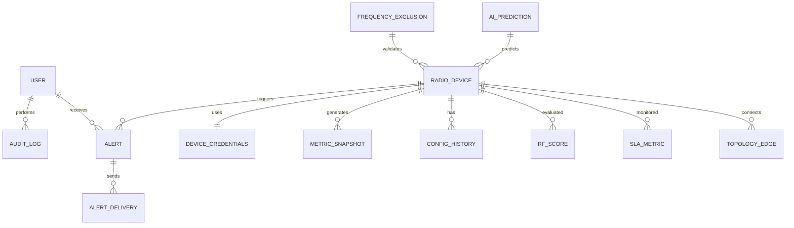

# 📘 Database Schema & ERD Documentation (Enhanced)

**System:** RF Spectrum Orchestration & Compliance Platform (RSOCP)
**Database:** PostgreSQL + TimescaleDB Extension
**Version:** 2.1 (Production Ready — FK constraints & enum types corrected)
**Date:** 2026-05-07

---

# 1. Overview

Dokumentasi ini mendefinisikan arsitektur database untuk sistem:

- RF Device Management
- Real-time Monitoring & Telemetry
- Configuration Orchestration
- Compliance Enforcement (Balmon)
- Alerting & Observability
- AI-driven Optimization (future-ready)

---

# 2. Architecture Principles

- **3NF Normalization**
- **Write-heavy optimized (Timeseries)**
- **Immutable Audit Trail**
- **Extensible for AI/ML**
- **Horizontal scalability ready**
- **Separation of transactional vs analytical data**

---

# 3. ERD (Logical)



---

# 3a. Enum Type Definitions

> Enum types harus didefinisikan secara eksplisit di PostgreSQL sebelum tabel yang merujuknya dibuat. Ini memastikan type safety di level database, bukan hanya di level aplikasi.

```sql
-- User roles
CREATE TYPE user_role AS ENUM ('SUPER_ADMIN', 'ENGINEER', 'NOC');

-- Vendor enum
CREATE TYPE device_vendor AS ENUM ('CAMBIUM', 'MIMOSA', 'OTHER');

-- Alert severity
CREATE TYPE alert_severity AS ENUM ('CRITICAL', 'HIGH', 'MEDIUM', 'LOW', 'INFO');

-- Alert channel
CREATE TYPE delivery_channel AS ENUM ('TELEGRAM', 'EMAIL', 'WEBHOOK', 'SLACK');

-- Delivery status
CREATE TYPE delivery_status AS ENUM ('SENT', 'FAILED', 'PENDING');

-- Frequency exclusion category
CREATE TYPE exclusion_category AS ENUM (
  'DFS_RADAR',
  'BMKG_RADAR',
  'SATELLITE',
  'AIRPORT_RADAR',
  'MILITARY_RESERVED'
);

-- AI prediction type
CREATE TYPE prediction_type AS ENUM (
  'INTERFERENCE_FORECAST',
  'FREQUENCY_DEGRADATION',
  'DEVICE_FAILURE'
);
```

---

# 4. Core Tables

## 4.1 User

```sql
CREATE TABLE user_account (
    id UUID PRIMARY KEY DEFAULT gen_random_uuid(),
    username VARCHAR(100) UNIQUE NOT NULL,
    password_hash TEXT NOT NULL,
    role user_role NOT NULL,
    mfa_secret TEXT,                    -- TOTP secret (NULL jika MFA belum diaktifkan)
    mfa_enabled BOOLEAN DEFAULT false,
    last_login_at TIMESTAMP,
    created_at TIMESTAMP DEFAULT now()
);
```

---

## 4.2 Radio Device

```sql
CREATE TABLE radio_device (
    id UUID PRIMARY KEY DEFAULT gen_random_uuid(),
    vendor device_vendor NOT NULL,
    model VARCHAR(100),
    ip_address INET UNIQUE NOT NULL,
    mac_address VARCHAR(50) UNIQUE,
    firmware_version VARCHAR(50),
    antenna_gain INT CHECK (antenna_gain >= 0 AND antenna_gain <= 50),
    frequency INT CHECK (frequency >= 5150 AND frequency <= 5925),  -- 5 GHz band
    channel_width INT CHECK (channel_width IN (5, 10, 20, 40, 80)),
    tx_power INT CHECK (tx_power >= 0 AND tx_power <= 30),
    country_code VARCHAR(10),
    gps_sync BOOLEAN DEFAULT false,
    parent_radio_id UUID REFERENCES radio_device(id) ON DELETE SET NULL,
    credentials_id UUID REFERENCES device_credentials(id) ON DELETE RESTRICT,  -- FK wajib; tidak boleh hapus credentials yang masih dipakai device
    is_balmon_active BOOLEAN DEFAULT false,
    created_at TIMESTAMP DEFAULT now()
);

-- Catatan desain: CHECK constraint pada frequency dan tx_power mencegah engineer
-- menyimpan nilai di luar rentang fisik yang valid. Validasi ini berlapis dengan
-- validasi di application layer (NestJS class-validator) untuk defense-in-depth.
```

---

## 4.3 Device Credentials

```sql
CREATE TABLE device_credentials (
    id UUID PRIMARY KEY,
    username VARCHAR(100),
    encrypted_password TEXT,
    snmp_community VARCHAR(100),
    created_at TIMESTAMP DEFAULT now()
);
```

---

## 4.4 Frequency Exclusion

```sql
CREATE TABLE frequency_exclusion (
    id UUID PRIMARY KEY DEFAULT gen_random_uuid(),
    start_freq INT NOT NULL,
    end_freq INT NOT NULL,
    category exclusion_category NOT NULL,
    description TEXT,
    CONSTRAINT chk_freq_range CHECK (start_freq < end_freq)
);
```

---

# 5. Timeseries (Monitoring Layer)

## 5.1 Metric Snapshot (TimescaleDB Hypertable)

```sql
CREATE TABLE metric_snapshot (
    time TIMESTAMPTZ NOT NULL,
    radio_id UUID,
    rssi FLOAT,
    snr FLOAT,
    cinr FLOAT,
    noise_floor FLOAT,
    throughput_tx FLOAT,
    throughput_rx FLOAT,
    retry_rate FLOAT,
    temperature FLOAT,
    cpu_usage FLOAT,
    memory_usage FLOAT
);

SELECT create_hypertable('metric_snapshot', 'time');
```

---

# 6. Configuration & Audit

## 6.1 Config History

```sql
CREATE TABLE config_history (
    id UUID PRIMARY KEY,
    radio_id UUID REFERENCES radio_device(id),
    config_snapshot JSONB,
    version INT,
    created_at TIMESTAMP DEFAULT now()
);
```

---

## 6.2 Audit Log (Immutable)

```sql
CREATE TABLE audit_log (
    id UUID PRIMARY KEY,
    user_id UUID REFERENCES user_account(id),
    radio_id UUID REFERENCES radio_device(id),
    action VARCHAR(100),
    old_config JSONB,
    new_config JSONB,
    status VARCHAR(20),
    timestamp TIMESTAMP DEFAULT now()
);
```

---

# 7. Alerting System

## 7.1 Alert

```sql
CREATE TABLE alert (
    id UUID PRIMARY KEY DEFAULT gen_random_uuid(),
    radio_id UUID REFERENCES radio_device(id) ON DELETE CASCADE,
    alert_type VARCHAR(50) NOT NULL,
    severity alert_severity NOT NULL DEFAULT 'MEDIUM',
    message TEXT,
    triggered_at TIMESTAMP NOT NULL DEFAULT now(),
    resolved_at TIMESTAMP,
    CONSTRAINT chk_resolved_after_triggered CHECK (resolved_at IS NULL OR resolved_at >= triggered_at)
);
```

---

## 7.2 Alert Delivery

```sql
CREATE TABLE alert_delivery (
    id UUID PRIMARY KEY DEFAULT gen_random_uuid(),
    alert_id UUID REFERENCES alert(id) ON DELETE CASCADE,
    channel delivery_channel NOT NULL,
    status delivery_status NOT NULL DEFAULT 'PENDING',
    sent_at TIMESTAMP,
    error_message TEXT  -- Menyimpan error jika delivery gagal (non-nullable pada kondisi FAILED)
);
```

---

# 8. Advanced Tables (NEW)

## 8.1 RF Score (Optimization Engine)

```sql
CREATE TABLE rf_score (
    id UUID PRIMARY KEY,
    radio_id UUID REFERENCES radio_device(id),
    score FLOAT,
    interference_level FLOAT,
    congestion_level FLOAT,
    calculated_at TIMESTAMP DEFAULT now()
);
```

---

## 8.2 SLA Metrics

```sql
CREATE TABLE sla_metric (
    id UUID PRIMARY KEY,
    radio_id UUID REFERENCES radio_device(id),
    uptime_percentage FLOAT,
    packet_loss FLOAT,
    latency FLOAT,
    measured_at TIMESTAMP
);
```

---

## 8.3 AI Prediction Logs

```sql
CREATE TABLE ai_prediction (
    id UUID PRIMARY KEY,
    radio_id UUID REFERENCES radio_device(id),
    prediction_type VARCHAR(50),
    predicted_value FLOAT,
    confidence FLOAT,
    created_at TIMESTAMP DEFAULT now()
);
```

---

## 8.4 Topology Graph (Edge-based)

```sql
CREATE TABLE topology_edge (
    id UUID PRIMARY KEY,
    from_radio UUID REFERENCES radio_device(id),
    to_radio UUID REFERENCES radio_device(id),
    link_quality FLOAT,
    distance FLOAT,
    created_at TIMESTAMP DEFAULT now()
);
```

---

# 9. Indexing Strategy

```sql
CREATE INDEX idx_radio_ip ON radio_device(ip_address);
CREATE INDEX idx_metric_time ON metric_snapshot(time DESC);
CREATE INDEX idx_metric_radio_time ON metric_snapshot(radio_id, time DESC);
CREATE INDEX idx_alert_radio ON alert(radio_id);
CREATE INDEX idx_audit_radio ON audit_log(radio_id);
CREATE INDEX idx_topology_from ON topology_edge(from_radio);
```

---

# 10. Partitioning & Scaling

### Timeseries

- Gunakan **TimescaleDB compression**
- Retention policy:

```sql
SELECT add_retention_policy('metric_snapshot', INTERVAL '30 days');
```

### Horizontal Scaling

- Read replicas untuk analytics
- Write node khusus ingestion metrics

---

# 11. Security Design

- Password hashing → **Argon2 / bcrypt**
- Credential encryption → **AES-256**
- Role-based access control
- Audit log tidak boleh di-update/delete

---

# 12. Data Flow Summary

1. Device → kirim metrics → `metric_snapshot`
2. Engine → hitung RF score → `rf_score`
3. System → generate alert → `alert`
4. User → perubahan config → `audit_log`
5. AI → prediksi → `ai_prediction`

---

# 13. Future Enhancements

- Graph DB (Neo4j) untuk topology kompleks
- Kafka pipeline untuk ingestion
- Feature store untuk ML
- Multi-tenant schema support

---

# 14. Conclusion

Versi ini sudah:

- ✅ Production-grade
- ✅ Scalable hingga ribuan device
- ✅ Siap integrasi AI/ML
- ✅ Compliance-ready (Balmon)
- ✅ Observability lengkap

Database ini bisa langsung dijadikan fondasi backend sistem RF orchestration modern.

---
